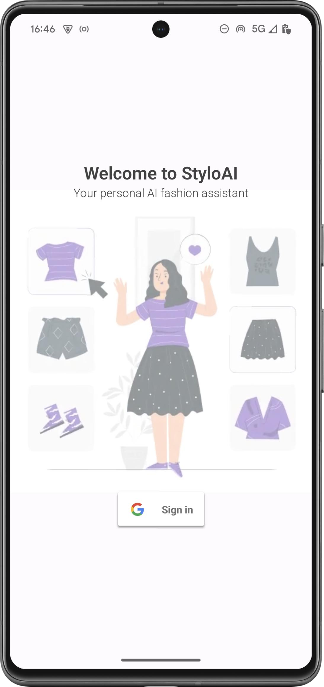
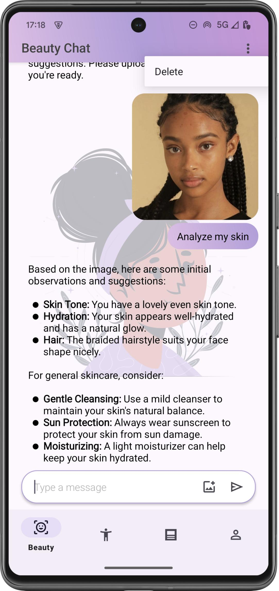
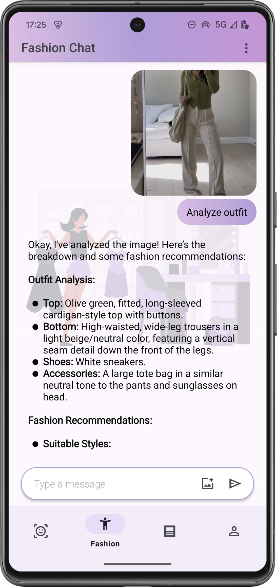
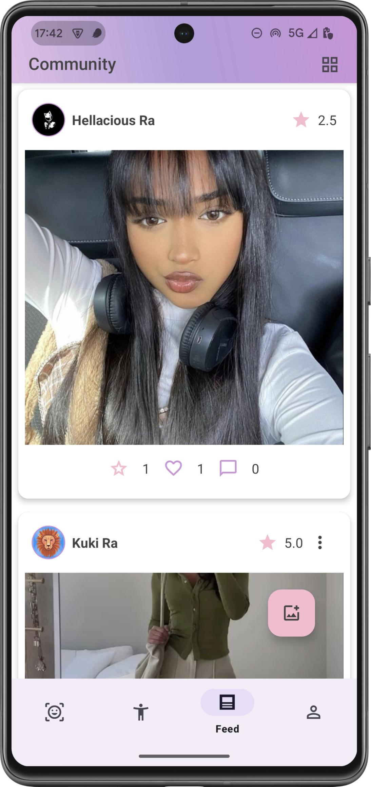
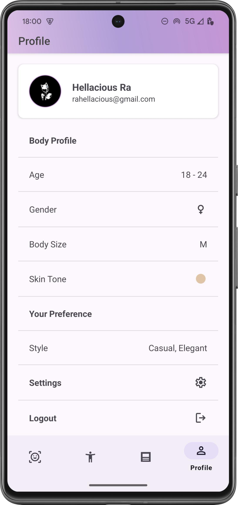
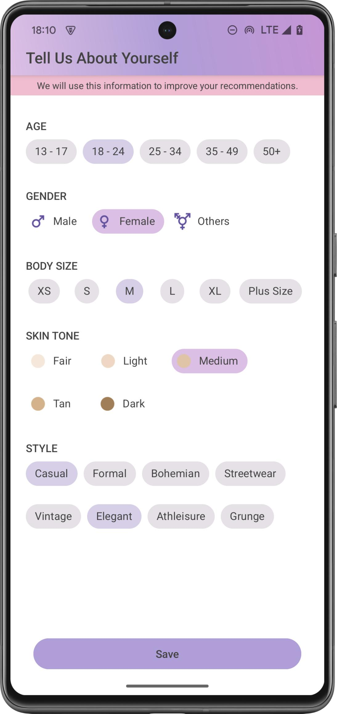

# StyloAI
# AI-powered Fashion and Beauty Recommendation App

This project is an Android-based AI-powered fashion and beauty recommendation app that offers users personalized style suggestions based on their facial and body attributes. It combines machine learning, Firebase services, and cloud image processing to deliver real-time, interactive fashion insights.

---

## 📥 Download APK

👉 **[Download APK from Google Drive](https://drive.google.com/drive/folders/17SWoELcmwZsusnbUQmJeXXR1gVsw2svr)**  
> *Note: Enable "install from unknown sources" on your device to use the APK.*

---

## 📸 Screenshots

  
 
 
 
 

---

## ✨ Features

- AI-powered fashion & beauty recommendations
- Facial/body feature analysis from uploaded images
- Firebase Authentication for secure login
- Real-time sync using Firestore
- AI chatbot for style guidance
- Image sharing capabilities

---

## 🛠️ Technologies Used

- **Kotlin** & **Android Studio**
- **Firebase Authentication** and **Firestore**
- **Cloud-based ML image analysis**
- Modular and scalable Android architecture

---

## 🚀 Future Enhancements

- AR-based virtual try-on experience
- Smarter AI recommendation engine
- More styling categories & filters

---

## 🔒 Security

User data and photos are securely handled with Firebase Authentication and Firestore. Only authenticated users can access personalized features.

